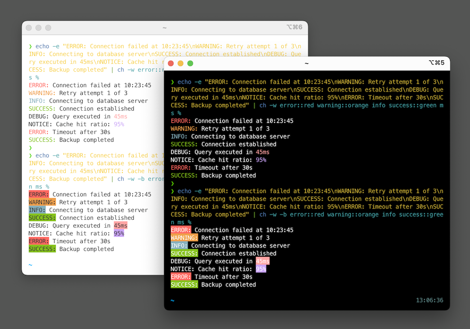

# ch - Colored Highlighter

A fast, simple terminal tool to highlight specific words in your command output with colors. Perfect for tailing logs, debugging, and making command output more readable.



## Features

- Automatic color assignment from a preset palette
- Custom hex colors for specific words
- Case-insensitive matching by default
- Whole word extension mode
- Fast and efficient - designed for real-time log tailing
- Cross-platform - works on macOS and Linux

## Installation

If you have go installed, run:

```shell
go install github.com/dtonon/ch@latest
```

## How It Works

`ch` reads from standard input line by line and:

1. Searches for specified words (case-insensitive by default)
2. Highlights matches with assigned colors
3. Handles overlapping matches (first match wins)
4. Outputs to standard output with ANSI color codes

The tool is optimized for streaming, making it ideal for real-time log monitoring.

## Usage

### Basic syntax

```bash
ch [options] <word1> <word2> <word3> ...
```

Highlights specified words with colors from a preset palette.

### Custom colors

```bash
ch <word1>::<HEXCOLOR> <word2>::<COLORNAME> <word3> ...
```

Use custom hex colors (with or without `#` prefix) or named colors. Words without specified colors use preset colors.

Available named colors: `red`, `green`, `orange`, `blue`, `pink`, `purple`

### Options

- `-s` - Case-sensitive matching (default is case-insensitive)
- `-w` - Whole word extension - extends match until space or end of line
- `-b` - Use background colors instead of foreground colors

#### Case-sensitive matching

```bash
# Only highlights exact case matches
echo "Error ERROR error" | ch -s Error
```

#### Whole word extension

The `-w` flag extends the match to the entire word (until space or EOL):

```bash
# Input: "Notice: backup 13344 - started with name backup_13344.zip"
echo "Notice: backup 13344 - started with name backup_13344.zip" | ch -w back

# Highlights: "backup" and "backup_13344.zip" (entire words)
```

#### Background colors

The `-b` flag uses background colors instead of foreground colors:

```bash
# Highlight with background colors
tail -f app.log | ch -b error warning success

# Mix with custom colors
tail -f app.log | ch -b error::red warning::orange info::blue
```

### Color palette

The preset colors use a pastel palette optimized for readability on both light and dark terminals:

1. Red
2. Green
3. Orange
4. Blue
5. Pink
6. Purple

Colors cycle when you have more than 6 words without custom colors.

## Examples

### Log monitoring

```bash
# Tail a log file with highlighted keywords
tail -f app.log | ch error warning success

# Highlight with custom colors (hex and named)
tail -f app.log | ch error::red warning::orange info::00FF00

# Monitor system logs
journalctl -f | ch failed::red error::red success::green started::blue

# Watch Docker logs
docker logs -f container_name | ch error warning started stopped

# Monitor Kubernetes pods
kubectl logs -f pod-name | ch error panic fatal warning
```

### Database and queries

```bash
# Highlight database queries
tail -f query.log | ch SELECT INSERT UPDATE DELETE

# Database monitoring
mysql -e "SHOW PROCESSLIST;" | ch SELECT UPDATE DELETE INSERT
```

### Development and debugging

```bash
# Search and highlight
grep -i "error" app.log | ch error exception failed

# Highlight build output
make 2>&1 | ch error warning success completed

# Git log highlighting
git log --oneline | ch feat fix docs style refactor

# Highlight code patterns
cat script.sh | ch function if else error
```

### Combining features

```bash
# Mix preset, named, and hex colors
tail -f app.log | ch error::red warning::FF5500 info debug success::green

# Case-insensitive by default (highlights: error, Error, ERROR, ErRoR, etc.)
tail -f app.log | ch error

# Monitor web server logs with named colors
tail -f access.log | ch GET::blue POST::orange 404::red 500::red 200::green
```

## Build

### From source

```bash
# Clone or download the repository
git clone <repository-url>
cd ch

# Initialize Go module
go mod init ch

# Build
go build -o ch

# (Optional) Install to your PATH
sudo mv ch /usr/local/bin/
```

## Performance

`ch` uses buffered I/O and processes input line by line, making it efficient for:

- Large log files
- Real-time streaming with `tail -f`
- High-throughput pipelines
- Continuous monitoring scenarios

## Requirements

- Go 1.16 or higher (for building)
- Terminal with ANSI color support (most modern terminals)
- macOS or Linux operating system

## License

MIT License - feel free to use and modify as needed.
